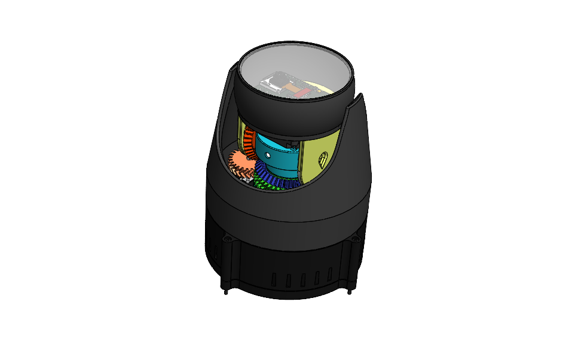

# Smoke Detector Camera

"Smoke Detector Camera" is a project that aims to detect smokers and vaporizer users in a closed environment. The project combines the development of a local website using Django and web technologies such as HTML, CSS, and JavaScript, with the connection of an ESP32-CAM camera running FreeRTOS. Additionally, libraries like OpenCV and PyTorch will be used for image calculations and analysis.

The Django-based website will receive and display the data captured by the camera, as well as perform additional processing to successfully differentiate smokers from vaporizer users. Deep learning models and algorithms will be employed to detect and classify actions and gestures related to tobacco and vaporizer consumption.

Furthermore, there is a possibility of building a database to store captured images for long-term recording and analysis. The SQL database management system provided by Django will be utilized for this purpose.

In summary, "Smoke Detector Camera" is a project that combines web technologies, computer vision, and deep learning to detect and differentiate smokers from vaporizer users in a closed environment.

# IoT Project Directory Structure

This repository contains the directory structure for an IoT project. The structure is designed to organize the different components of the project and provide a logical arrangement for source code, documentation, configuration files, and more.

## Directory Structure

The project directory is structured as follows:

- **/docs**: Contains project documentation files, including system architecture, API documentation, and user manuals. The documentation is written in LaTeX.

- **/src**: Holds the source code files for different components of the IoT system.
  - **/device**: Contains device-specific code, firmware, or software that runs on the IoT devices/sensors.
  - **/gateway**: Includes code related to the gateway or edge computing component of the IoT project.
  - **/cloud**: Contains code related to the cloud or backend infrastructure, including data processing, storage, and API endpoints.

- **/config**: Contains configuration files for different components or modules within the project.

- **/tests**: Includes test files for unit tests, integration tests, or any other test-related files.

- **/data**: Contains data files required for the project, such as sample datasets.

- **/deploy**: Holds deployment-related files, such as deployment scripts or configuration files.

- **/scripts**: Contains utility scripts that assist in development, automation, or deployment tasks.

- **/logs**: Holds log files generated by the application or system.

- **/cad**: Contains CAD files related to the project, such as component designs, enclosures, schematics, and diagrams.

- **/electronics**: Holds electronics-related files, such as circuit diagrams, PCB layouts, datasheets, and schematics.

## Usage

To use this directory structure for your own IoT project, you can follow these steps:

1. Clone or download this repository to your local machine.

2. Customize the directories and subdirectories based on your project requirements.

3. Add your project-specific files and code to the corresponding directories.

4. Update the README.md file to provide an overview of your project and instructions for setup or usage.

## Contributing

If you have any suggestions or improvements for the directory structure or would like to contribute to this project, please feel free to submit a pull request.

## License

This project is licensed under the [MIT License](LICENSE).
